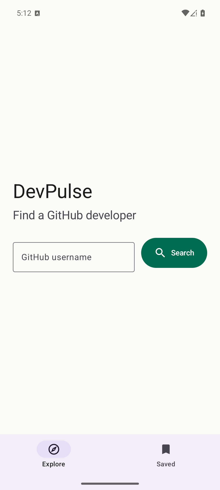
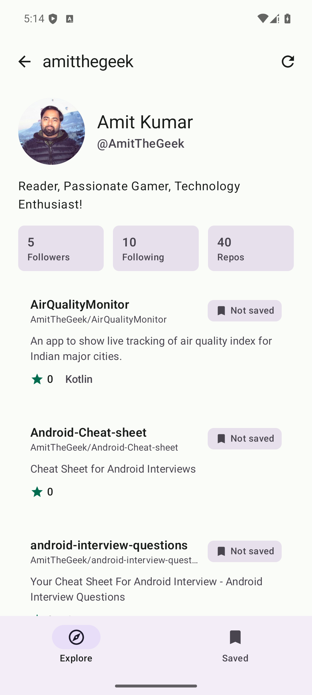
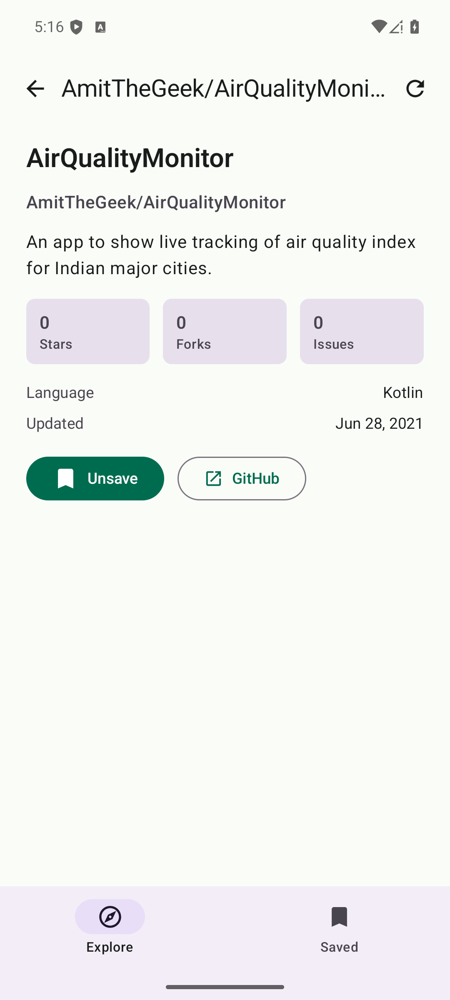
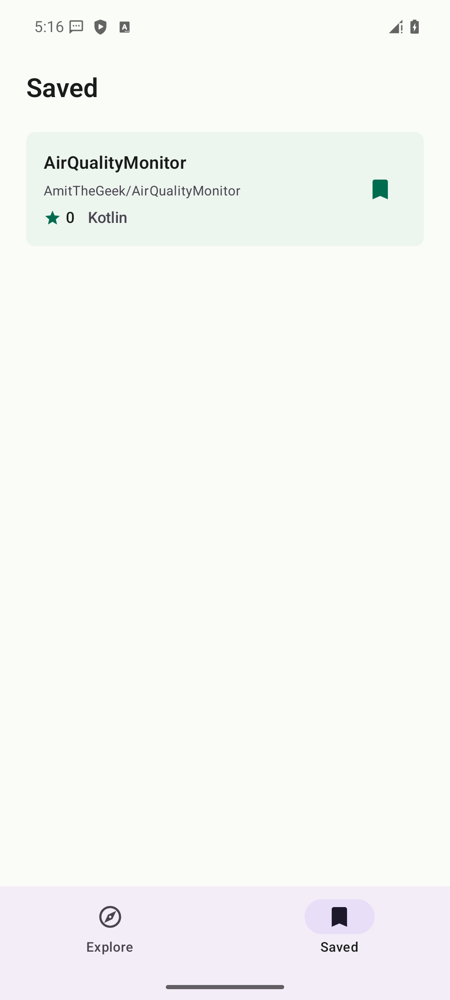
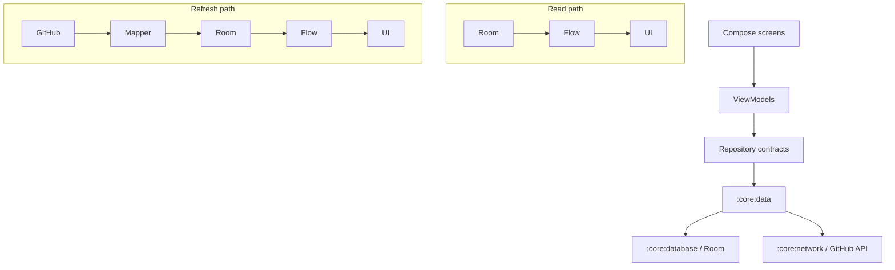

# DevPulse

[](https://github.com/AmitTheGeek/DevPulse/actions/workflows/android-ci.yml)

DevPulse is a Kotlin Android app for exploring GitHub developers and repositories. It exists as a focused production-style sample: a real Compose UI backed by a modular, offline-first data layer rather than a static demo screen.

## Screenshots

<p align="center">
  
  
  
  
</p>

## What DevPulse Demonstrates

- Kotlin, Jetpack Compose, and Material 3
- Modular Android architecture with isolated feature modules
- Room as the observable source of truth
- Offline-first reads with network-to-Room synchronization
- Separate remote-owned data and locally owned saved state
- Hilt dependency injection
- Screen-level `StateFlow` and unidirectional data flow
- Cache freshness policies with forced manual refresh
- Identifier-based navigation
- Explicit application error modelling
- Mapper, repository, ViewModel, and Compose/Robolectric tests
- Android lint, Detekt, and GitHub Actions CI

## Features

- GitHub developer search
- Developer Dashboard with profile stats and repository list
- Repository Detail with stars, forks, issues, language, update date, and GitHub link
- Save, unsave, and Saved repositories
- Cached offline reading for loaded developer and repository data
- Manual refresh
- Loading, error, empty, and cached-with-refresh-failure states

## Architecture



Reads come from Room-backed `Flow`s. Refresh operations call GitHub, map DTOs into persistence models, write Room, and let Flow emissions update UI state. See [ARCHITECTURE.md](ARCHITECTURE.md) for the deeper module and synchronization rationale.

## Module Structure

- `:app` - composition root, Hilt application setup, and top-level navigation.
- `:core:model` - dependency-free domain models consumed by app and feature code.
- `:core:network` - GitHub REST API, Retrofit/OkHttp setup, and remote DTOs.
- `:core:database` - Room database, DAOs, entities, saved-state table, and sync metadata.
- `:core:data` - repository contracts/implementations, mapping, errors, refresh policy, and synchronization.
- `:core:designsystem` - shared Material 3 theme and UI primitives.
- `:core:common` and `:core:testing` - shared foundations and test utilities.
- `:feature:search`, `:feature:developer`, `:feature:repository`, `:feature:saved` - independent feature slices that consume core contracts.

Feature modules do not depend on each other and do not directly depend on network or database modules.

## Offline-First Strategy

Room is the observable source of truth. Screens observe repository contracts that expose local `Flow`s, while refresh methods update Room rather than returning parallel UI data.

If refresh fails, cached data remains visible and the failure is surfaced as a non-destructive state. Saved repositories are locally owned in a separate table, so user intent is preserved across remote repository-list refreshes.

## Testing And Quality

- Mapper tests verify DTO/entity/domain transformations.
- In-memory Room repository tests cover synchronization, saved-state preservation, deleted-row handling, and error mapping.
- ViewModel tests cover screen-level state and refresh behavior.
- Compose/Robolectric tests cover important UI states and interactions.
- Android lint, Detekt, unit tests, and debug assembly run in GitHub Actions.
- Task 007 validated the MVP on an API 36 Android emulator with real screenshots.

## Build

```sh
./gradlew test
./gradlew lintDebug
./gradlew detekt
./gradlew assembleDebug
```

## Known Limitations

- GitHub API access is unauthenticated.
- Unauthenticated GitHub rate limits apply.
- Only the first 100 repositories are synchronized for a developer.
- Full pagination is not implemented.
- Paging 3 is not implemented.
- Background sync and WorkManager are not implemented.
- GitHub authentication is not implemented.
- README, commit, contributor, and release views are not implemented.

## Engineering Decisions

- DTOs, Room entities, and domain models are separate shapes.
- `RefreshPolicy.IfStale` supports automatic cache-aware refresh; `RefreshPolicy.Force` supports explicit user refresh.
- Saved state is stored separately from the remote repository snapshot.
- Navigation passes stable identifiers instead of domain objects.
